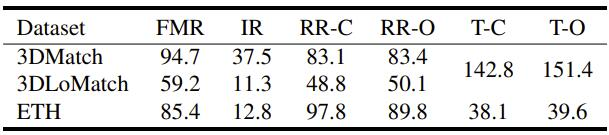

# You Only Match Once: Point Cloud Registration with Rotation-equivariant Descriptors

In this paper, we propose a novel local descriptor-based framework, called You Only Match Once (YOMO), for the registration of two unaligned point clouds. In contrast to most existing local descriptors which rely on a fragile local reference frame to gain rotation invariance, the proposed descriptor achieves the rotation invariance by recent technologies of group equivariant feature learning, which brings more robustness to point density and noise. Meanwhile, the descriptor in YOMO also has a rotation-equivariant part, which enables us to estimate the registration from just one correspondence.  Such property reduces the searching space for feasible transformations, thus greatly improves both the accuracy and the efficiency of YOMO. Extensive experiments show that YOMO achieves superior performances with much fewer needed RANSAC iterations on three widely-used datasets, the 3DMatch/3DLoMatch datasets and the ETH dataset. 

## News

- 2021.7.6 The code of the YOHO is released. [Code](https://github.com/HpWang-whu/YOHO)

## Performance 
   

## Requirements

Here we offer the PointNet backbone YOMO thanks to the [Spinnet]() training codes, so the Spinnet requirements need to be met:

- Ubuntu 16.04 or higher
- CUDA 11.1 or higher
- Python v3.6 or higher
- Pytorch v1.7 or higher
- Pointnet2_ops

## Installation

Create the anaconda environment:

```
conda create -n pn_yomo python=3.7
conda activate pn_yomo
conda install pytorch==1.7.1 torchvision==0.8.2 torchaudio==0.7.2 cudatoolkit=11.0 -c pytorch
pip install -r requirements.txt
export CUDA_HOME=/usr/local/cuda-11.1
pip install "git+git://github.com/erikwijmans/Pointnet2_PyTorch.git#egg=pointnet2_ops&subdirectory=pointnet2_ops_lib"
```

KNN build:

```
cd knn_search/
python setup.py build_ext --inplace
cd ..
```


## Data Preparation

We need the 3DMatch dataset (Train, Val) .

For the preparation of the Trainset of YOHO-PN, download [trainset](https://drive.google.com/file/d/1PrkSE0nY79gOF_VJcKv2VpxQ8s7DOITg/view?usp=sharing) Spinnet offering firstly.

Please place the trainset to ./data following Spinnet.

We offer the origin test datasets containing the point clouds (.ply) and keypoints (.txt, 5000 per point cloud) here [3dmatch/3dLomatch](https://drive.google.com/file/d/1UzGBPce5VspD2YIj7zWrrJYjsImSEc-5/view?usp=sharing) and [ETH](https://drive.google.com/file/d/1hyurp5EOzvWGFB0kOl5Qylx1xGelpxaQ/view?usp=sharing).

Please place the data to ```./data/origin_data``` for organizing the data structure as:

- data
  - origin_data
    -  3dmatch
      - sun3d-home_at-home_at_scan1_2013_jan_1
          - Keypoints
          - PointCloud
    - ETH
      - wood_autumn
        - Keypoints
        - PointCloud

## Train

To prepare the trainset of YOHO, run:
'''
cd backbone
python YOHO_trainset.py
cd ..
'''
The trainset of YOHO will be placed to '''data/YOHO_PN/Trainset''' and '''data/YOHO_PN/valset'''.


The training process of YOHO is two-stage, you can run with by the commands sequentially:

```
python Train.py --Part PartI
python Train.py --Part PartII
```

We also offer the pretrained models in ./model/PartI_train and ./model/PartII_train.

## Test on the 3dmatch/3dLomatch dataset

With the TestData downloaded above, the test on 3DMatch and 3DLoMatch can be done by:

- Prepare testset

```
cd backbone
python YOHO_testset.py --dataset 3dmatch --r 0.3
cd ..
```

- Eval the results:

```
python Test.py --Part PartI  --max_iter 1000 --dataset 3dmatch   --ransac_d 0.07 #YOHO-C on 3DMatch
python Test.py --Part PartI  --max_iter 1000 --dataset 3dLomatch --ransac_d 0.07 #YOHO-C on 3DLoMatch
python Test.py --Part PartII --max_iter 1000 --dataset 3dmatch   --ransac_d 0.09 #YOHO-O on 3DMatch
python Test.py --Part PartII --max_iter 1000 --dataset 3dLomatch --ransac_d 0.09 #YOHO-O on 3DLoMatch
```

where PartI is yoho-c and PartII is yoho-o, max_iter is the ransac times, PartI should be run first. All the results will be placed to ```./data/YOHO_PN```.


## Generalize to the ETH dataset

With the TestData downloaded above, without any refinement of the model trained on the indoor 3DMatch dataset, the generalization result on the outdoor ETH dataset can be got by:

- Prepare the testset

```
cd backbone
python YOHO_testset.py --dataset ETH --r 1
cd ..
```

- Eval the results:

```
python Test.py --Part PartI  --max_iter 1000 --dataset ETH  #YOHO-C on ETH
python Test.py --Part PartII --max_iter 1000 --dataset ETH  #YOHO-O on ETH
```
All the results will be placed to ```./data/YOHO_PN```.


## Related Projects

We thanks greatly for the Spinnet PerfectMatch and Predator for the backbone and datasets.

- [Spinnet](https://github.com/QingyongHu/SpinNet)
- [3DSmoothNet](https://github.com/zgojcic/3DSmoothNet) 
- [Predator](https://github.com/overlappredator/OverlapPredator) 

